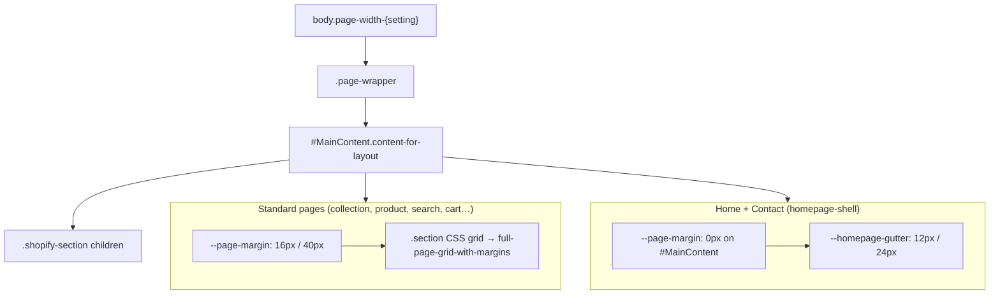

# Container Padding & Margin Audit

Research for **Category 1: main container padding & margin** (horizontal inset + top offset on the primary content shell).

Generated: 2026-08-18  
Companion tracker: [UI-POLISH-TRACKER.md](./UI-POLISH-TRACKER.md)

---

## Architecture overview

The theme uses **three parallel container systems**. They are not interchangeable.



### Global token definitions

| Token | Mobile | Desktop (≥750px) | Defined in |
|-------|--------|------------------|------------|
| `--page-margin` | `16px` | `40px` | `assets/base.css` (on `.page-width-*` body classes) |
| `--page-content-width` | varies by body class | | `assets/base.css` + `theme-styles-variables.liquid` |
| `--homepage-gutter` | `12px` | `24px` | `assets/base.css` (`body.template-index`, contact override) |
| `--homepage-frame-gap` | `20px` | `20px` | First section top gap under navbar (home) |
| `--homepage-radius` | `25px` | `25px` | Shell corner radius (home + contact) |

### Main DOM shell

| Element | File | Role |
|---------|------|------|
| `body.page-width-{wide\|normal\|narrow}` | `layout/theme.liquid` | Sets page width tier + enables `--page-margin` |
| `.page-wrapper` | `layout/theme.liquid` | Flex column; squeezes when drawer open |
| `#MainContent.content-for-layout` | `layout/theme.liquid` | **Primary main container** — all page sections render here |
| `#MainContent.homepage-shell` | `layout/theme.liquid` | Added on **index** + **page.contact** only |
| `.homepage-shell-frame` | `layout/theme.liquid` | Sticky rounded frame overlay (home + contact) |
| `.section` | `assets/base.css` | Grid-based section wrapper; computes central column from `--page-margin` |

---

## Classification key

| Tag | Meaning | Action for polish pass |
|-----|---------|------------------------|
| **GLOBAL** | Uses `--page-margin` or section grid tokens correctly | Verify value only; likely no change |
| **SHELL** | Uses `--homepage-gutter` / homepage-shell rules | Align within shell system; don't force `--page-margin` |
| **TEMPLATE** | Template-specific layout (overlap, rounded panel) | Review against design intent |
| **SECTION-LOCAL** | Section owns its own inset (e.g. `48px`, `clamp()`) | Decide: tokenize, keep, or align to shell |
| **HARDCODED** | Fixed px/rem with no token reference | Primary fix candidates on standard pages |

---

## Layer 1 — Global system files (source of truth)

These define or consume the main container. Touch these first when changing global inset.

| File | Tag | What it controls |
|------|-----|------------------|
| `assets/base.css` L298–423 | **GLOBAL** | `--page-margin`, `.section` grid, `.section--full-width-margin` side padding |
| `assets/base.css` L2409–2637 | **SHELL** | Homepage + contact shell: `--homepage-gutter`, per-section `padding-inline` overrides, `--page-margin: 0` |
| `layout/theme.liquid` L127–138 | **SHELL** | `#MainContent` + `homepage-shell` class assignment |
| `snippets/theme-styles-variables.liquid` L127–135 | **GLOBAL** | `--narrow-page-width`, `--normal-page-width`, `--wide-page-width` |
| `snippets/section.liquid` | **GLOBAL** | Applies `section--{page-width\|full-width}` to sections |
| `snippets/spacing-style.liquid` | **GLOBAL** | Section/block padding via CSS vars (vertical + inline from theme editor) |
| `snippets/collection-wrapper-styles.liquid` | **GLOBAL** | Collection/search grid columns using `--page-margin` |
| `snippets/product-grid.liquid` L359 | **GLOBAL** | `padding-inline: var(--page-margin)` on grid context |
| `snippets/resource-list-carousel.liquid` | **GLOBAL** | `--util-page-margin-offset` for carousel gutters |
| `sections/header.liquid` L792–797 | **GLOBAL** | Header columns: `margin-inline: var(--page-margin)` |
| `sections/reference-utility-bar.liquid` L219 | **GLOBAL** | `padding-inline: var(--page-margin)` |
| `blocks/_cart-summary.liquid` L96 | **GLOBAL** | Cart summary: `padding: … var(--page-margin) …` |

---

## Layer 2 — Template-specific main container behavior

### Home (`template-index`) — **SHELL**

| Location | Behavior | Tag |
|----------|----------|-----|
| `#MainContent.homepage-shell` | Sets `--page-margin: 0px` | **SHELL** |
| All direct `.shopify-section` children | Default `padding-inline: var(--homepage-gutter)` | **SHELL** |
| `.immersive-video-banner-section` | Black bg; inherits default gutter | **SHELL** |
| `.peek-hero-carousel-section` | Explicit gutter + own peek logic | **SHELL** + **SECTION-LOCAL** |
| `.image-compare-showcase-section` | `padding-inline: 0` (internal 48px inset) | **SECTION-LOCAL** |
| `.marquee-section` | Edge-to-edge | **SHELL** override |
| `.parallax-sale-banner-section` | Gutter inset | **SHELL** |
| `.hotspot-product-showcase-section` | Edge-to-edge | **SHELL** override |
| `.review-quote-slider-section` | Edge-to-edge | **SHELL** override |
| `.best-sellers-showcase-section` | Edge-to-edge shell; **internal** `clamp(1rem, 3vw, 2rem)` | **SHELL** + **HARDCODED** |
| `.story-collection-carousel-section` | Edge-to-edge shell; **internal** `padding-inline: 48px` (20px mobile) | **SECTION-LOCAL** |
| `.featured-product-information-section` | Edge-to-edge; section owns inset | **SECTION-LOCAL** |
| `.diagonal-logo-marquees-section` | Edge-to-edge | **SHELL** override |
| First section | `margin-top: var(--homepage-frame-gap)` | **SHELL** |

**Home section count with shell `padding-inline: 0` override:** 8 of ~12 section types (edge-to-edge inside shell).

---

### Contact (`page.contact`) — **SHELL**

| Location | Behavior | Tag |
|----------|----------|-----|
| `#MainContent.homepage-shell` | Same as home: `--page-margin: 0` | **SHELL** |
| `body.template-page:has(.contact-page-section)` | Copies home shell tokens (`--homepage-gutter`, radius) | **SHELL** |
| `sections/contact-page.liquid` | Form wrapper: `padding: clamp(2rem, 4vw, 3.5rem) clamp(1.5rem, 4vw, 3.5rem) …` | **HARDCODED** |
| `sections/contact-page.liquid` L295 | `padding-right: 2.25rem` on select | **HARDCODED** |

---

### Collection (`template-collection`) — **TEMPLATE**

| Location | Behavior | Tag |
|----------|----------|-----|
| `sections/main-collection.liquid` L119–127 | `.collection-page-products` `margin-top: -2.75rem` + `border-radius: 28px` | **TEMPLATE** |
| `sections/main-collection.liquid` L350–353 | Mobile: `margin-top: -1.75rem`, radius `20px` | **TEMPLATE** |
| `sections/main-collection.liquid` L173 | Toolbar: `padding: 1.15rem clamp(1rem, 3vw, 2rem) 0.85rem` | **HARDCODED** |
| `sections/collection-hero.liquid` L150–152 | Content bounds: `max(var(--page-margin), 2rem)` | **GLOBAL** + **HARDCODED** floor |
| `snippets/collection-wrapper-styles.liquid` | Grid uses `--page-margin` | **GLOBAL** |
| `snippets/product-grid.liquid` | Grid padding uses `--page-margin` | **GLOBAL** |

---

### Product (`template-product`) — **GLOBAL** + **SECTION-LOCAL**

| Location | Behavior | Tag |
|----------|----------|-----|
| `snippets/product-information-content.liquid` | `section--page-width` via settings; uses standard section grid | **GLOBAL** |
| `snippets/product-information-content.liquid` L461–467 | Reference layout: `padding-left/right: clamp(...)` | **HARDCODED** |
| `sections/product-story-toc.liquid` L93 | Pin position: `left: max(1rem, var(--page-margin, 1.5rem))` | **GLOBAL** + fallback |
| Below-fold sections (`product-also-like`, `product-faqs`, etc.) | Each has own section padding via schema / inline CSS | **SECTION-LOCAL** — not yet audited in detail |

---

### Standard templates (search, cart, blog, 404, generic page)

| Template | Main container path | Tag |
|----------|---------------------|-----|
| Search | `main-collection` pattern + `collection-wrapper-styles` | **GLOBAL** |
| Cart | `sections/main-cart.liquid` → `.section--page-width` grid | **GLOBAL** |
| Blog / article | Section grid + `main-blog` narrows `--page-content-width` | **GLOBAL** + width override |
| Generic page | `sections/main-page.liquid` → `.page-width-content` | **GLOBAL** |
| 404 | Standard section blocks in template JSON | **GLOBAL** |

---

## Layer 3 — Files using `--page-margin` (standard system)

These correctly reference the global token. **Do not rewrite unless changing the token itself.**

| File | Usage |
|------|-------|
| `assets/base.css` | Token definition, section grid, full-width-margin sections |
| `sections/header.liquid` | Header column horizontal margin |
| `sections/collection-hero.liquid` | Hero content horizontal bounds |
| `sections/reference-utility-bar.liquid` | Utility bar inline padding |
| `sections/slideshow.liquid` | Page-width slideshow inset |
| `sections/media-with-content.liquid` | Content block padding |
| `sections/main-blog.liquid` | Page width calc |
| `sections/main-cart.liquid` | Cart layout calc |
| `snippets/product-grid.liquid` | Product grid horizontal padding |
| `snippets/collection-wrapper-styles.liquid` | Collection grid columns + title margin |
| `snippets/resource-list-carousel.liquid` | Carousel gutter offset |
| `blocks/_cart-summary.liquid` | Summary horizontal padding |
| `sections/product-story-toc.liquid` | Sticky nav left offset |

---

## Layer 4 — Files with personal / hardcoded horizontal overrides

Primary candidates when normalizing standard-page inset. **Not all should become `--page-margin`** — some are intentionally tighter (mega menu, PDP catalogue column).

### High priority (main page content feel)

| File | Override | Tag | Notes |
|------|----------|-----|-------|
| `sections/main-collection.liquid` | `margin-top: -2.75rem`, toolbar `clamp(1rem, 3vw, 2rem)` | **TEMPLATE** / **HARDCODED** | Defines collection "card under hero" look |
| `sections/contact-page.liquid` | `clamp(1.5rem, 4vw, 3.5rem)` horizontal | **HARDCODED** | Inside shell; should relate to `--homepage-gutter` |
| `sections/reference-footer.liquid` | Multiple `clamp(1rem, 3vw, 2rem)` etc. | **HARDCODED** | Footer spans all templates |
| `sections/best-sellers-showcase.liquid` | `clamp(1rem, 3vw, 2rem)` inner padding | **HARDCODED** | Home edge-to-edge section with internal inset |
| `sections/story-collection-carousel.liquid` | `padding-inline: 48px` / `20px` mobile | **SECTION-LOCAL** | Does not use `--homepage-gutter` or `--page-margin` |
| `sections/reference-collections-grid.liquid` | `--rcg-body-x-padding: 1.75rem` | **SECTION-LOCAL** | Own token; not tied to global |
| `snippets/product-information-content.liquid` | `clamp(1.25rem, 3vw, 2.25rem)` etc. | **HARDCODED** | PDP reference layout only |
| `sections/peek-hero-carousel.liquid` | Peek + `clamp(1.5rem, 3.5vw, 2.75rem)` slide padding | **SECTION-LOCAL** | Hero-specific; couples to `--peek-side` |

### Medium priority (navigation / secondary surfaces)

| File | Override | Tag | Notes |
|------|----------|-----|-------|
| `blocks/_header-menu.liquid` | `clamp(1.5rem, 3vw, 3rem)`, `28px` min padding | **HARDCODED** | Mega menu panels — not main container |
| `sections/collection-hero.liquid` | `max(--page-margin, 2rem)` | **GLOBAL** + floor | 2rem floor may exceed token on some viewports |

### Lower priority (components, not page shell)

| File | Override | Tag | Notes |
|------|----------|-----|-------|
| `blocks/filters.liquid` | Various drawer/form padding | **SECTION-LOCAL** | Filter UI, not page container |
| `snippets/cart-drawer.liquid` | Drawer-specific | **SECTION-LOCAL** | Separate system |
| `sections/product-also-like.liquid` | Schema `padding-inline-*` | **SECTION-LOCAL** | Below-fold; separate pass |

---

## Layer 5 — Top margin / vertical offset (related)

These affect where content starts vertically, often paired with horizontal polish.

| File | Override | Tag | Templates |
|------|----------|-----|-----------|
| `assets/base.css` L891 | `margin-top: calc(var(--header-group-height) * -1)` | **GLOBAL** | Transparent header overlap |
| `assets/base.css` L2527–2528 | `--homepage-frame-gap` on first home section | **SHELL** | Index |
| `sections/main-collection.liquid` L123 | `margin-top: -2.75rem` | **TEMPLATE** | Collection |
| `sections/main-collection.liquid` L352 | Mobile `-1.75rem` | **TEMPLATE** | Collection |
| `body.template-page:has(.contact-page-section) .reference-footer-section` | `margin-top: 0` | **SHELL** | Contact |

---

## Recommended fix order (Category 1)

1. **Decide target values** — Should standard pages stay `16/40px`? Should shell gutter stay `12/24px` or match page margin?
2. **Map shell internal sections** — Replace ad-hoc `48px`, `clamp(1rem, 3vw, 2rem)` with `--homepage-gutter` or a new `--shell-content-inset` token.
3. **Collection template** — Confirm `-2.75rem` overlap + toolbar padding align with chosen horizontal inset.
4. **Footer + contact** — Largest cross-template hardcoded clamps; unify first for consistency sitewide.
5. **PDP reference layout** — Separate pass; clamp values may be layout-specific not page-margin.
6. **Leave mega menu / drawers** — Different surfaces; token-align later.

---

## Quick reference: which system applies where?

| Page | Horizontal inset source | Top offset source |
|------|-------------------------|-------------------|
| Home | `--homepage-gutter` on sections (with per-section 0 overrides) | `--homepage-frame-gap` |
| Contact | `--homepage-gutter` + contact form `clamp()` | Shell frame |
| Collection | `--page-margin` via section grid + toolbar hardcode | `-2.75rem` overlap |
| Product | `--page-margin` via section grid + PDP clamps | Section spacing settings |
| Search | `--page-margin` via collection wrapper | Section spacing settings |
| Cart / blog / 404 / page | `--page-margin` via section grid | Section spacing settings |

---

## Grep commands (re-run audit after changes)

```bash
# All page-margin consumers
rg "var\\(--page-margin\\)|--page-margin" --glob "*.{liquid,css}"

# Homepage shell
rg "homepage-shell|homepage-gutter" --glob "*.{liquid,css}"

# Hardcoded horizontal padding suspects
rg "padding-inline:\\s*[0-9]|clamp\\([^)]*rem[^)]*vw" --glob "*.{liquid,css}"

# Template-specific main overrides
rg "template-collection|template-index|template-page:has" --glob "*.{liquid,css}"
```

---

## Open questions (resolve before coding)

1. Should `--homepage-gutter` (12/24px) eventually equal `--page-margin` (16/40px), or stay tighter for the rounded shell aesthetic?
2. Is collection `margin-top: -2.75rem` paired with hero intentional for all collection pages?
3. Should `reference-footer` use `--page-margin` on standard pages and `--homepage-gutter` on home/contact?
4. Is `story-collection-carousel` `48px` inset meant to match a specific reference mockup value?

Record answers in [UI-POLISH-TRACKER.md](./UI-POLISH-TRACKER.md) **Decisions log** when confirmed.
